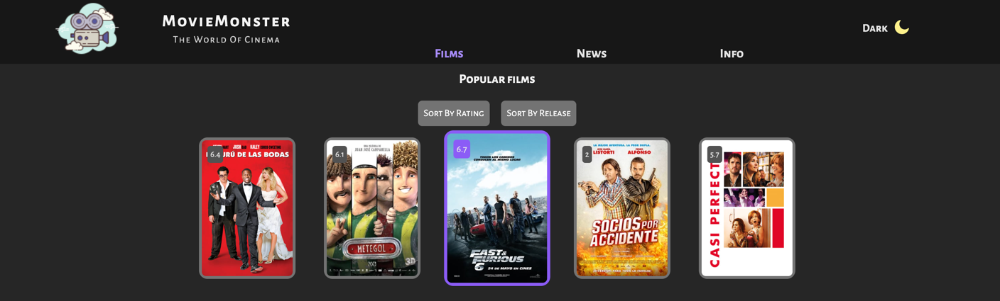

## MovieMonster

***

***

### Description

_Simple SPA about films:_
- *includes three pages:* 
    * *[Films](#films);*
    * *[News](./README.md/#news);*
    * *[Info](./README.md/#info);*
- *__header__ for navigation and switch theme;*
- *__footer__ for contacts;*

***

#### `Films`
 _This is default and main page at the same time,
 includes twenty films and options to sort it by rating and release date
 powered by __Movies API__.
 You can click on film item and go to page with film description 
 and opportunity to leave the comment!_

***

#### `News`
 _This page includes ten links for fresh news about films 
 powered by __Movies API__!_

***

#### `Info`
 _This page has two blocks:_
 * *__search block__ - you can search film's info by name and year
   powered by __Movies API__;*
 * *__info block__ - it includes rules and random quote powered by
   __DummyJSON API__ for more motivation;*
 
***

### Tech Stack

* HTML;
* CSS/SCSS;
* Tailwind CSS;
* React JS;
* Redux Toolkit;

***

### Contacts

For feedback:`Gambit47@yandex.ru` 
Deployed:`https://posts-page-1.vercel.app/`
